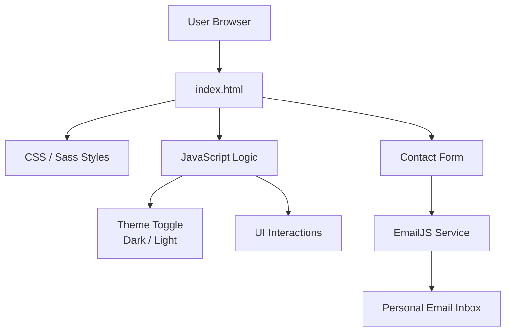

# 🌐 Personal Portfolio Website

A modern, responsive **personal portfolio website** built with **HTML5, CSS3, Sass, and JavaScript**, designed to showcase my projects, skills, experience, and provide an easy way to contact me.

🔗 **Live Website:** https://andreimuzarau.com/  
🔗 **GitHub Repository:** https://github.com/amuzarau/My-Portfolio-Website_HTML5_CSS3_SASS_JavaScript  

---

## 📌 Project Overview

This project is a **personal portfolio website in English** (with plans to add a multilingual version in the future).  
The website is **responsive**, optimized for desktop device, and includes both **dark and light themes**, implemented using JavaScript.

✨ **UI interactions:**
- On hover, the **Download CV** and **Submit Message** buttons change color
- Profile photo switches from **black & white to color** on hover
- Smooth animations and transitions for a modern user experience

---

## 🧩 Website Sections

### 🏠 Home
- Profile photo with hover effect (black & white → color)
- Short personal introduction
- **Downloadable PDF résumé**, opened in a new tab

### 👤 About Me
- Link to PDF résumé (opens in a new tab)
- **Skill progress bars** visualizing professional competencies
- **Career timeline** showing where I worked and where I currently work

### 💼 My Portfolio
- Showcases personal and educational projects
- Links to live demos and GitHub repositories

### 📝 My Blogs
- Blog posts related to programming, learning, and technology

### 📬 Contacts
- Contact form powered by **EmailJS**
- Messages are sent directly to my personal email
- Links to **GitHub and social networks**

---

## 🛠️ Technology Stack

| Technology | Purpose |
|-----------|--------|
| **HTML5** | Semantic page structure |
| **CSS3** | Styling, animations, layout |
| **Sass (SCSS)** | Modular, maintainable styling |
| **JavaScript (ES6+)** | Theme switching, interactivity |
| **EmailJS** | Contact form email delivery |

---

## ⭐ Key Benefits of the Project

- ✅ **Clean and semantic HTML5 structure**
- 🎨 **Sass architecture** for scalable and maintainable styles
- 🌗 **Dark / Light theme toggle** using JavaScript
- 📱 **Fully responsive design**
- ⚡ **Interactive UI elements and hover effects**
- 📩 **Real contact form integration** (EmailJS, no backend required)
- 🚀 **Fast loading & lightweight**
- 💼 Designed as a **professional developer portfolio**

---

## 📁 Project Structure

```text
My-Portfolio-Website_HTML5_CSS3_SASS_JavaScript/
│
├── index.html                # Main HTML file
├── app.js                    # JavaScript logic (theme switch, interactions)
├── README.md                 # Project documentation
│
├── styles/
│   ├── styles.scss           # Main Sass file
│   ├── _media.scss           # Responsive media queries
│   ├── styles.css            # Compiled CSS
│   └── styles.css.map        # Source map for debugging
│
├── img/
│   ├── skills/
│   │   ├── excel.svg
│   │   └── powerbi.svg
│   │
│   ├── blog1.jpg
│   ├── blog2.jpg
│   ├── blog3.jpg
│   │
│   ├── hero.png
│   │
│   ├── port1.jpg
│   ├── bati port2.jpg
│   ├── port3.jpg
│   ├── port4.jpg
│   ├── port5.jpg
│   ├── port6.jpg
│   ├── port7.jpg
│   ├── port8.jpg
│   ├── port9.jpg
│   └── port10.jpg

```

---

## 🔁 Project Architecture (Mermaid Diagram)



---

## 🚀 How to Run Locally
# Clone the repository
git clone https://github.com/amuzarau/My-Portfolio-Website_HTML5_CSS3_SASS_JavaScript.git

# Open index.html in your browser


No backend or build tools are required.
For Sass editing, recompile SCSS to CSS after changes.

---

## 🔮 Planned Improvements

# 🌍 Multilingual version of the website:

English

German

French

Italian

Polish


# 🖼️ Certificates gallery

Interactive slider using Swiper JS

Display of IT course certificates
